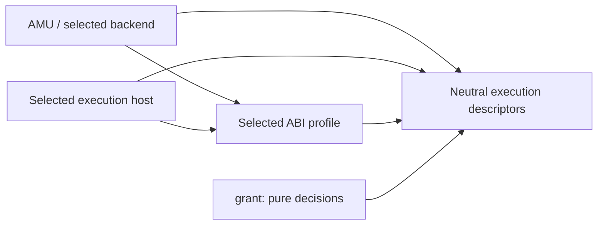

# kotoba-lang/abi

Versioned target profiles and compatibility contracts for the Kotoba execution stack.

`abi` owns Component/WIT worlds, physical capability import names,
component-admission envelopes, profile bindings and legacy v1 wire codecs.
Target-neutral descriptors are owned by `kotoba.core.execution` in core-contracts.  It deliberately owns neither a
Wasm engine, policy decision, device driver, scheduler, nor deployment client.

## Lisp machine architecture

AiueOS is the OS for a modern Kotoba Lisp machine in development. Kototama
is its implementation-independent Lisp VM contract: closed S-expression
computation, IPLD state, bounded authority and content-addressed receipts.
Amu checks and compiles code; grant decides permission; runtime hosts and OS
mechanisms enforce the admitted boundary. Kototama also has hosted engines
and does not require AiueOS for every execution.

The [stack architecture](https://github.com/kotoba-lang/kotoba-lang/blob/main/docs/stack-architecture.md) separates responsibility, source/library
and artifact dependencies. Its [composition contract](https://github.com/kotoba-lang/kotoba-lang/blob/main/lang/stack-architecture.edn) routes
to each owner's specification; it is not a new language or runtime semantics.
"Modern Lisp machine" describes the architectural direction. It does not
certify a complete integrated debugger, live system modification, full heap
image restore, selfhost compiler or physical-machine qualification.

## Stack

Shared descriptors and target profiles are separate contract boundaries.
The public entrypoints are split: core-contracts owns neutral descriptors and
abi owns Component profiles. Mixed v1 wire data remains an explicit compatibility
codec; existing runtime admission is unchanged.



WIT/Canonical ABI belongs to the Component profile. Native calling conventions,
Script bridges and EVM ABI are distinct target bindings. The current WIT-bound
fields are not silently made optional or renamed by this document.

The Component-profile runtime path is:

```text
compiler → signed Component + declared imports
         → kototama validates, links, budgets, and executes
         → grant decides each declared import; aiueos enforces and provides it
         ← sahai places the workload (murakumo for its inference fleet); neither grants authority
```

Native engines implement the same admission/VM boundary through their declared
ABI. A Component illustration does not make AiueOS mandatory for hosted engines.

## Contents

- [`wit/kotoba-app`](wit/kotoba-app) is the current `kotoba:app/kotoba-app@0.1.0`
  world emitted by the compiler.
- [`wit/aiueos-capability`](wit/aiueos-capability) reserves the provider-facing
  capability vocabulary.  It has no ambient WASI, filesystem, environment,
  network, clock, random, or process interface.
- [`wit/aiueos-capability-v3`](wit/aiueos-capability-v3) adds the host-owned,
  non-serializable packet-device resource used by Kekkai OS tunnel adapters;
  it grants no ambient socket or descriptor access.
- [`schemas/component-admission-v1.schema.json`](schemas/component-admission-v1.schema.json)
  is the closed hand-off envelope that a runtime must validate before invoking
  an engine linker.
- `kotoba.abi.contract` also owns closed v1 descriptors for a portable plan,
  basis-bound policy decision, plan/policy/basis-bound approval witness,
  non-bearer capability lease, and immutable execution identity. They are the
  common receipt contract; concrete host handles remain local and
  non-serializable.
- [`schemas/portable-execution-v1.schema.json`](schemas/portable-execution-v1.schema.json)
  provides the JSON Schema form of those descriptors for non-Clojure consumers.
- [`90-docs/adr/2607252600-abi-ownership.edn`](90-docs/adr/2607252600-abi-ownership.edn) records
  ownership and dependency rules.

## Dependency rule

Each consumer pins an ABI release and may generate language bindings from WIT.
No consumer may import another consumer's implementation merely to share a
contract.  In particular, the compiler never imports the aiueos kernel;
Kototama never decides grants; and Murakumo never receives a provider handle or
secret merely because it placed a component.

Murakumo placement fencing uses
`kotoba.abi.contract/valid-component-authority-event?`: an exact versioned
Component CID, epoch, sequence, event kind, and optional placement node.
Murakumo owns epoch advancement; Kototama authenticates, orders, and consumes
the events before named provider calls.

Authority events cross processes only inside
`:murakumo.component-authority/v1` Ed25519 envelopes. The canonical signing
payload binds the trusted key identifier, issuer, audience, issuance time, and
every event field; public keys are configured by the receiver and are never
self-asserted by an envelope.

New shared code earns a separate repository only when it has two or more
independent consumers and can remain below this authority boundary.  Examples
include generated WIT bindings or canonical artifact codecs.  Policy, engine,
and control-plane code stay in their owning repositories.

## Target-neutral and distributed stack architecture

Currently owns both portable descriptors and Component/WIT-specific fields. The adopted direction separates neutral contract entrypoints from target profiles; common execution descriptors have core-contracts as the candidate migration owner. WIT/Canonical ABI is a Component profile, not universal language semantics. Physical native, Script and EVM bindings remain distinct. No schema fields or hash identities are changed by this documentation.

See the [owner integration guide and dependency direction](docs/stack-architecture.md),
[composition metadata](spec/stack-integration.edn), and
[whole-stack refactor procedure](https://github.com/kotoba-lang/kotoba-lang/blob/main/docs/stack-refactor-procedure.md).
The direction is adopted; runtime contract migration and qualification remain
explicit, separately verified work. Tier labels are responsibility axes, not
a single dependency ranking.

## Implemented neutral / target-profile boundary

`kotoba.core.execution` owns bounded semantic ability, stream, plan, policy and
approval data, plus explicitly versioned neutral v2 identity/lease validators.
Its complete source closure has no requires and imports no WIT, engines, DB,
network or consensus. `:target` in an ability is a resource selector.

`kotoba.abi.component` owns Component worlds/imports/admission/authority fences
and the unchanged mixed v1 identity/lease codecs. `kotoba.abi.contract` preserves
all 46 existing exports as compatibility aliases. New consumers choose an
explicit entrypoint. No v1 block, signature, WIT output or existing runtime
admission shape is rewritten automatically. V2 identities reference the CID of
a target-owned binding; hosts must verify its bytes, profile, interface and
artifact before granting authority. A v2 block needs a new CID/signature.

Component v1/v2 bindings are implemented here; unknown targets/profiles refuse.
Native/Script/EVM bindings must be owned and qualified by their selected backend,
not encoded as nil WIT fields. V2 runtime admission is not enabled by this API
refactor, and this is not Q9 source migration or target qualification.

## Explicit v2 execution

See [execution v2](docs/execution-v2.md) and [owner contract](spec/execution-v2.edn).
New target bindings, authority-issued invocation/leases and authenticated admission
are explicit APIs; existing v1 runtime defaults remain compatible.
