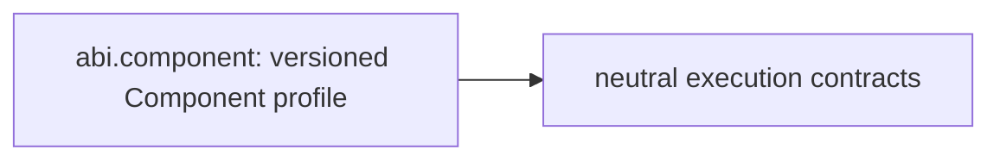

# abi: stack integration

Status: accepted architecture direction, 2026-10-10. This document and
[composition metadata](../spec/stack-integration.edn) describe ownership and
future boundaries; they do not change runtime schemas or certify migration.

## Responsibility

Owns versioned target profiles and legacy v1 compatibility. Neutral execution
descriptors now belong to `kotoba.core.execution` in core-contracts (15 exports,
zero source imports). `kotoba.abi.component` exposes 39 Component/WIT/WASI
profile exports; `kotoba.abi.contract` preserves the original 46 exports and
v1 wire/CID/signature/WIT semantics. Explicit Component binding/v1 projection
connects the new neutral v2 identity without changing default runtime admission.
Native, Script and EVM mechanisms remain in their selected backend/host owners.

## Contract dependency direction

Arrows are consumer → contract dependency. These are intended entrypoint
boundaries, not whole-repository imports already achieved.

The measured selected-owner production dependencies at base `af5e5379d767c9172ddecbec1b2e76b84fdc58f6`
were none among the selected 13 owners. The implemented split now adds a direct
core-contracts dependency; see the refreshed current observation.
This selection excludes other libraries; alias-only build/test imports remain
separate in the [full observation](https://github.com/kotoba-lang/kotoba-lang/blob/main/lang/stack-dependency-observation.edn).

## Shared architecture and refactor rules

- [Whole stack and distributed flow](https://github.com/kotoba-lang/kotoba-lang/blob/main/docs/stack-architecture-target-neutral.ja.md)
- [Machine-readable architecture direction](https://github.com/kotoba-lang/kotoba-lang/blob/main/lang/stack-architecture-target-neutral.edn)
- [Current measured dependency graph](https://github.com/kotoba-lang/kotoba-lang/blob/main/docs/stack-dependencies-current.md)
- [Coordinated refactor procedure](https://github.com/kotoba-lang/kotoba-lang/blob/main/docs/stack-refactor-procedure.md)
- [Japanese presentation](https://github.com/kotoba-lang/kotoba-lang/blob/main/docs/presentations/kotoba-lisp-machine.ja.md)

Target, host, distribution and consistency are independent selection axes; their
Cartesian product is not a support matrix. Unknown/unqualified profiles fail
closed. Preserve existing wire keys, CID rules and reader compatibility until
a versioned migration. Migrate whole components and public closures; Q9 is
JVM-free. Qualify actual artifacts, denied paths, limits and receipts per
target × host × operation × consistency.

Keep source dependencies, artifact flow, runtime composition and service
relationships separate. No readiness follows for debugger/live editing, heap
image restoration, selfhost, C-free production or physical hardware.

The implemented API boundary is specified in [component-profile.edn](../spec/component-profile.edn). Neutral source closure is measured separately from repository dependency closure. Existing package/codec helpers remain separate entrypoints.
